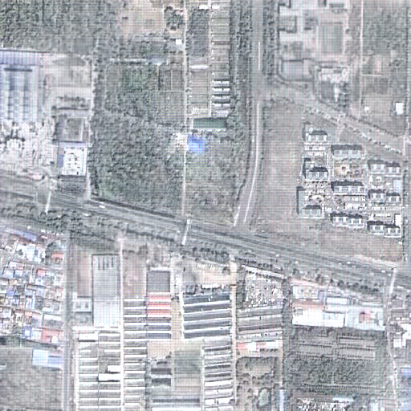

###  Encoder-minimal and Decoder-minimal Framework for Remote Sensing Image Dehazing

**Abstract**: Haze obscures remote sensing images, hindering valuable information extraction. To this end, we propose RSHazeNet, an encoder-minimal and decoder-minimal framework for efficient remote sensing image dehazing. Specifically, regarding the process of merging features within the same level, we develop an innovative module called intra-level transposed fusion module (ITFM). This module employs adaptive transposed self-attention to capture comprehensive context-aware information, facilitating the robust context-aware feature fusion. Meanwhile, we present a cross-level multi-view interaction module (CMIM) to enable effective interactions between features from various levels, mitigating the loss of information due to the repeated sampling operations. In addition, we propose a multi-view progressive extraction block (MPEB) that partitions the features into four distinct components and employs convolution with varying kernel sizes, groups, and dilation factors to facilitate view-progressive feature learning. Extensive experiments demonstrate the superiority of our proposed RSHazeNet. We release the source code and all pre-trained models at https://github.com/chdwyb/RSHazeNet.

### News 🚀🚀🚀

- **July 21, 2023**: We have identified the underlying reasons behind DehazeFormer's production of low-quality images with high metric scores. The subsequent code present in `test.py` file leads to suboptimal visual outcomes. Moreover, we provide two illustrative examples to substantiate this finding.

  ```python
  # [-1, 1] to [0, 1]
  output = output * 0.5 + 0.5
  target = target * 0.5 + 0.5
  ```

  |  |  |
  | :--------------------------------------------: | :--------------------------------------------------: |
  |  **With the transform of [-1, 1] to [0, 1]**   |    **Without the transform of [-1, 1] to [0, 1]**    |


### Requirements

```python
python 3.8.6
torch 1.9.0
torchvision 0.11.0
pillow 9.2.0
scikit-image 0.19.3
timm 0.6.7
tqdm 4.64.0
opencv-python 4.5.2.54
```

### Train

If you intend to conduct training on our proposed RSHazeNet using your own datasets, it is imperative to initially ascertain the training and testing paths specified in `options.py`. Specifically, the paths should be provided in the manner illustrated below.

```python
# training
self.Input_Path_Train = './Haze1k-thick/train/hazy/'
self.Target_Path_Train = './Haze1k-thick/train/gt/'
# validation
self.Input_Path_Val = './Haze1k-thick/val/hazy/'
self.Target_Path_Val = './Haze1k-thick/val/gt/'
```

Subsequently, you may attempt the execution of the following command in order to initiate the training process.

```python
python train.py
```

### Pre-trained models

To facilitate expeditious testing on the datasets utilized in our study, we additionally furnish all the pre-trained models for the purpose of any conceivable verification.

| Dataset           | Link                                                         | Dataset              | Link                                                         |
| ----------------- | ------------------------------------------------------------ | -------------------- | ------------------------------------------------------------ |
| StateHaze1K-thick | [[Baidu Cloud](https://pan.baidu.com/s/1KGz0Lyo6E3mDJBSdDzFfgg), code: rsid]   [[Google Drive](https://drive.google.com/file/d/1Leyg1sw4x48wEo5zsPKBGtVaCF5NWdY_/view?usp=sharing)] | StateHaze1K-moderate | [[Baidu Cloud](https://pan.baidu.com/s/1cyzLZFK0-pX-uyUC3yTAXQ), code: rsid]   [[Google Drive](https://drive.google.com/file/d/1Jxz0ZpMUAFYP-4nYS4__HyxR506_kF7d/view?usp=sharing)] |
| StateHaze1K-thin  | [[Baidu Cloud](https://pan.baidu.com/s/16rhnMKq47mqlgZ5hYE_bLw), code: rsid]   [[Google Drive](https://drive.google.com/file/d/15FeoHGhfRSk22zWzWfH96mHIjjnoHb-z/view?usp=sharing)] | RS-Haze              | [[Baidu Cloud](https://pan.baidu.com/s/11CQE01WXtxGX9bdigkiMJg), code: rsid]   [[Google Drive](https://drive.google.com/file/d/1-UD3eJeAULBB4mzf3SvNMdzAvuSLFK9G/view?usp=sharing)] |
| LHID              | [[Baidu Cloud](https://pan.baidu.com/s/1rF3eYJ6f7s5mVmIO9NriQg), code: rsid]   [[Google Drive](https://drive.google.com/file/d/1L0yDz4aP5NfNetqSmHC1CV7GiL45b8nK/view?usp=sharing)] | DHID                 | [[Baidu Cloud](https://pan.baidu.com/s/1n9uh8daqVDmFkkr3skQw9A), code: rsid]   [[Google Drive](https://drive.google.com/file/d/14RSfxdepbhaLBmPfryzCc1erGn1cjrOn/view?usp=sharing)] |
| RICE              | [[Baidu Cloud](https://pan.baidu.com/s/1IdaugM5MrxH8QMFeT6sy4g), code: rsid]   [[Google Drive](https://drive.google.com/file/d/1FsABBJRbUA0mJbzsjMlMofI7exe5T82D/view?usp=sharing)] | RSID                 | [[Baidu Cloud](https://pan.baidu.com/s/12cZt2e4p85u2n59pYZ-rvw), code: rsid]   [[Google Drive](https://drive.google.com/file/d/1HozsEo2H49SpRMb0ws1VBULqUevSpboA/view?usp=sharing)] |
| Dense-Haze        | [[Baidu Cloud](https://pan.baidu.com/s/1KM6QneCvYZ_Bh0nCP6Eh5Q), code: rsid]   [[Google Drive](https://drive.google.com/file/d/1h83Gcy9Z4ET1m5Jw-b15HR4h9x4hWk_h/view?usp=sharing)] | NH-Haze              | [[Baidu Cloud](https://pan.baidu.com/s/15pzjMIT2IjzjDlUTIMcZ1g), code: rsid]   [[Google Drive](https://drive.google.com/file/d/13vqNv1SzIt1bxEsSYjl_Y5zAYXKfLbLn/view?usp=sharing)] |

### Test

To assess the effectiveness of our proposed RSHazeNet on your personalized datasets, it is imperative to initially identify the testing paths delineated in the `options.py` file. For instance, the paths should be specified in the following format.

```python
# testing
self.Input_Path_Test = './Haze1k-hick/test/hazy/'
self.Target_Path_Test = './Haze1k-hick/test/gt/'
self.Result_Path_Test = './Haze1k-hick/test/result/'
```

Subsequently, it may be necessary to modify the path of the pre-trained model as illustrated below.

```python
#  pre-trained model
self.MODEL_PRE_PATH = './rs_haze.pth'
```

Now you can proceed with the testing phase and assess the performance of our proposed RSHazeNet.

```pyth
python test.py
```

### Dataset

If you intend to conduct experiments on our collected real-world remote sensing hazy dataset, named RRSD300, please download it from [[Baidu Cloud](https://pan.baidu.com/s/1lM9vEvDwgDrCoyPJAW490A), code: rsid] or [[Google Drive](https://drive.google.com/file/d/198dmAL5Vrw1qm_f5t4nW8l1Jmw-HNLuy/view?usp=sharing)].

### Contact  us

This repository is currently under preparation. If you have any inquiries or questions regarding our work, please feel free to contact us at wyb@chd.edu.cn.
